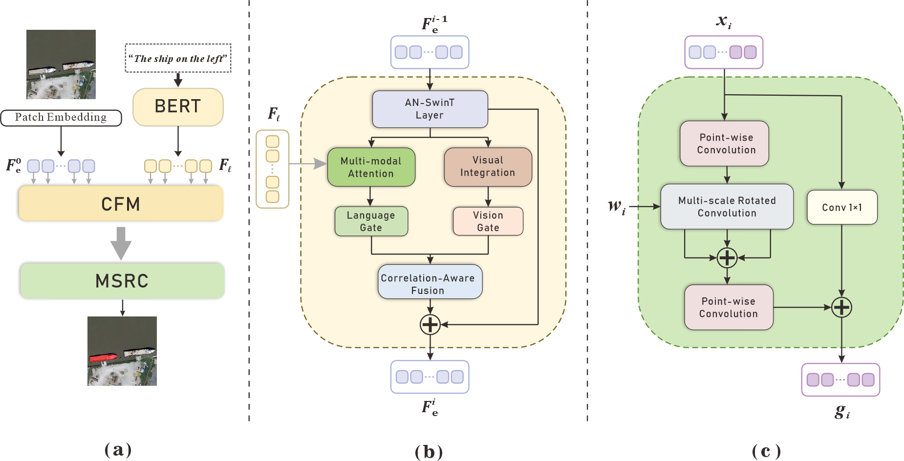

# Multimodal-Aware Fusion Network For Referring Remote Sensing Image Segmentation
Code for our GRSL 2025 paper"[Multimodal-Aware Fusion Network for Referring Remote Sensing Image Segmentation]"


Contributed by Leideng Shi, Juan Zhang*.

## Getting Started

### Installation
Install the dependencies.

The code was tested on Ubuntu 20.04.6, with Python 3.7 and PyTorch v1.12.1.

1. Clone this repository.

    ~~~
    git clone https://github.com/Roaxy/MQN.git 
    ~~~
2. Create a new Conda environment with Python 3.7 then activate it:
   
    ~~~
   conda create -n MQN python==3.7
   conda activate MQN
    ~~~
3. Install pytorch v1.12.1 (CUDA 10.2 is used in this example).

    ~~~
    conda install pytorch==1.12.1 torchvision==0.13.1 torchaudio==0.12.1 cudatoolkit=10.2 -c pytorch
    ~~~
    
4. Install the requirements.
    
    ~~~
    pip install -r requirements.txt
    ~~~
    


## Datasets
### RRSIS-D
RRSIS-D dataset can be downloaded from [Google Drive](https://drive.google.com/drive/folders/1Xqi3Am2Vgm4a5tHqiV9tfaqKNovcuK3A?usp=sharing) or [Baidu Netdisk](https://pan.baidu.com/s/1yZatV2w_bSXIP9QBv2lCrA?pwd=sjoe), and then follow [RMSIN](https://github.com/Lsan2401/RMSIN) datasets usage. The files and make
directories as follows.
```
$DATA_PATH
├── rrsisd
│   ├── refs(unc).p
│   ├── instances.json
└── images
    └── rrsisd
        ├── JPEGImages
        ├── ann_split
```
finishing downloading, unpack the tarball (`hico_20160224_det.tar.gz`) to the `data` directory.
## Pre-trained model
Download the pre-trained classification weights of the Swin Transformer for [SwinT_base](https://github.com/SwinTransformer/storage/releases/download/v1.0.0/swin_base_patch4_window12_384_22k.pth)
, and put the `pth` file in `./pretrained_weights`.
These weights are needed for training to initialize the model.
## Training
After the preparation, you can start training with the following commands. We use DistributedDataParallel from PyTorch for training. To run on 2 GPUs (with IDs 0, 1) on a single node:
```
sh ./train.sh
```
## Testing
```
# default setting
sh ./test.sh
```
You may modify codes in `test.sh:11` to use `val` instead of `test`. By default, we set the split to `test`.
## Visualization
## Acknowledgements
